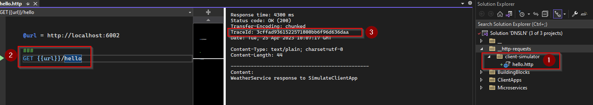
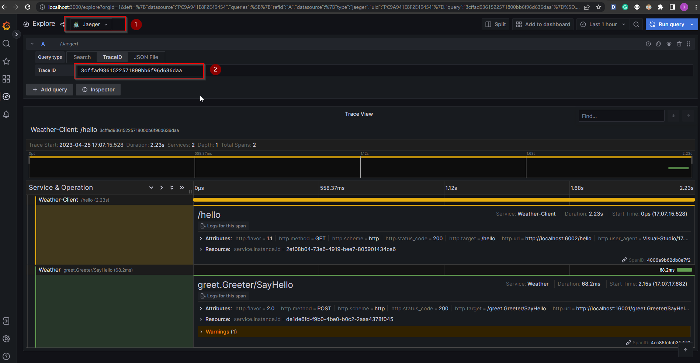
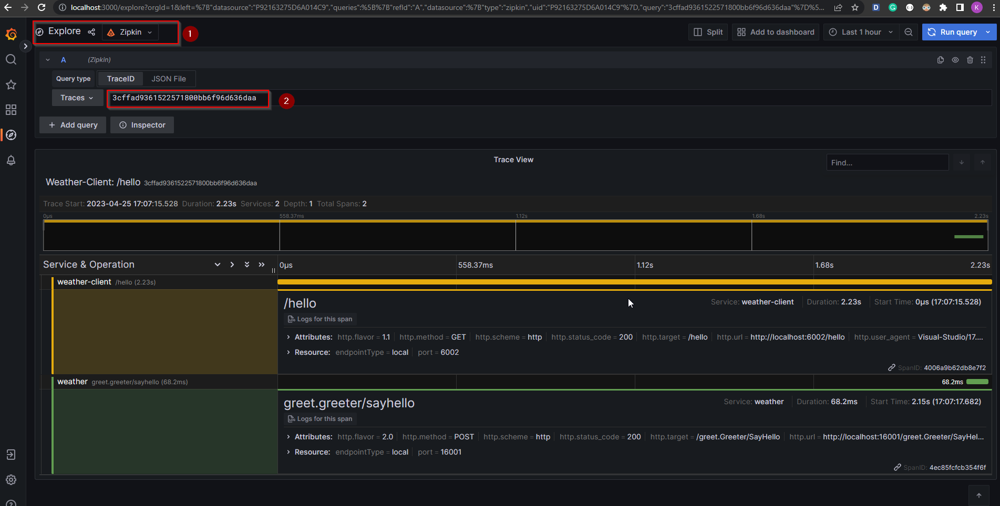
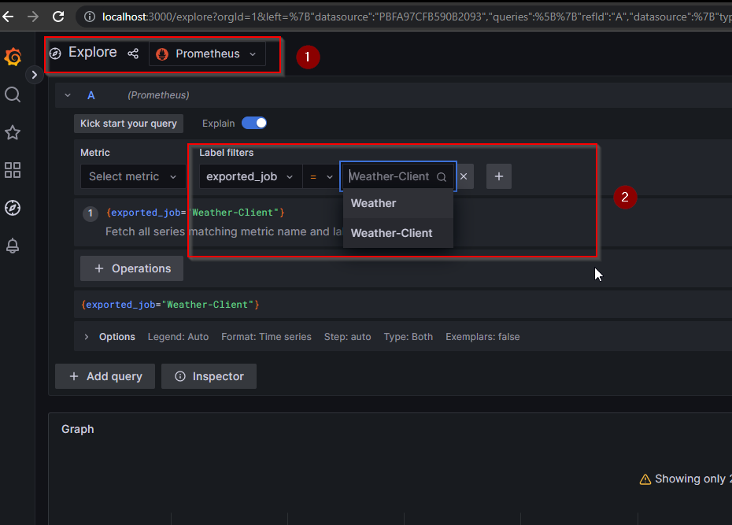
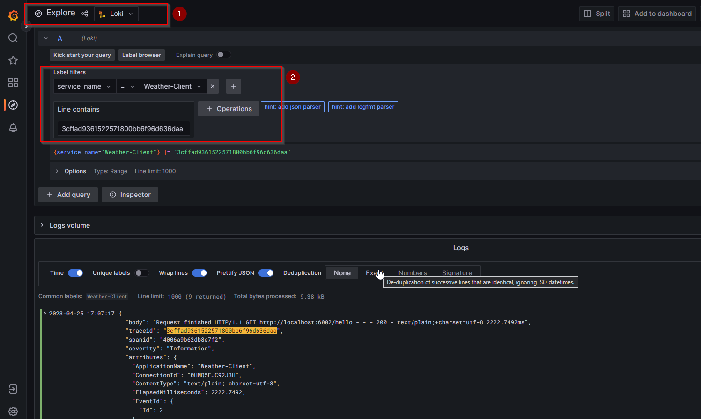

# .NET with OpenTelemetry Collector

## Overview

- Use [OpenTelemetry](https://opentelemetry.io) to collect traces and metrics and [Serilog](https://serilog.net) to collect log's messages; then all of them will only export to [OpenTelemetry Collector](https://opentelemetry.io/docs/collector/) (OTEL collector in short).

- The collector then exports to
  - [Zipkin](https://zipkin.io/) and/or [Jaeger](https://www.jaegertracing.io/) for tracings
  - [Prometheus](https://prometheus.io/) for metrics
  - [Loki](https://github.com/grafana/loki) for log's messages

- All of them are visualized on [Grafana](https://grafana.com/)

## Quick Start

1. Starting infrastructure from docker compose

```bash
docker compose -f ./local/infra/docker-compose.observability.yaml up -d
```

2. Starting service by using [tye](https://github.com/dotnet/tye)

```bash
tye run ./local/tye/tye.yaml --dashboard
```

3. Observe

- Making some requests to `http://localhost:6002/hello` or execute via Visual Studio



- Access `grafana` at `http://localhost:3000` to explore 4 datasources: Jaeger, Zipkin, Prometheus & Loki










## Development

### OpenTelemetry

```xml
<PackageVersion Include="OpenTelemetry.Exporter.OpenTelemetryProtocol" Version="1.4.0" />
<PackageVersion Include="OpenTelemetry.Exporter.OpenTelemetryProtocol.Logs" Version="1.4.0-rc.4" />
<PackageVersion Include="OpenTelemetry.Extensions.Hosting" Version="1.4.0" />
<PackageVersion Include="OpenTelemetry.Instrumentation.AspNetCore" Version="1.0.0-rc9.14" />
```

### Serilog

```xml

<PackageVersion Include="Serilog.AspNetCore" Version="6.1.0" />
<PackageVersion Include="Serilog.Enrichers.Context" Version="4.6.0" />
<PackageVersion Include="Serilog.Sinks.OpenTelemetry" Version="1.0.0-dev-00129" />

```

### Register & configure

- Refer to [ObservabilityRegistration.cs](./src/BuildingBlocks/BuildingBlocks.Observability/ObservabilityRegistration.cs)

- There are the following methods that named as its functionality
  - `AddTracing`
  - `AddMetrics`
  - `AddSerilog`

- There is only one `public` method which is `AddObservability`. This is used in [Program.cs](./src/Microservices/Microservices.WeatherService/Program.cs)

```csharp

var webApplicationBuilder = WebApplication.CreateBuilder(args);

webApplicationBuilder.AddObservability();

// Other lines of code

```

---

## Give a Star! :star2:

If you liked this project or if it helped you, please give a star :star: for this repository. Thank you!!!

---

## Resources

- [Tye: Service Discovery](https://github.com/dotnet/tye/blob/main/docs/reference/service_discovery.md)

- [Automatic Instrumentation of Containerized .NET Applications With OpenTelemetry](https://www.twilio.com/blog/automatic-instrumentation-of-containerized-dotnet-applications-with-opentelemetry)

- [Containerize a .NET app with dotnet publish](https://learn.microsoft.com/en-us/dotnet/core/docker/publish-as-container)

- [Built-In Container Support for .NET 7 – Dockerize .NET Applications without Dockerfile!](https://codewithmukesh.com/blog/built-in-container-support-for-dotnet-7/)

- [Install the .NET SDK or the .NET Runtime on Alpine](https://learn.microsoft.com/en-us/dotnet/core/install/linux-alpine)